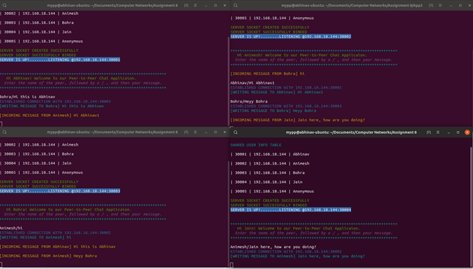
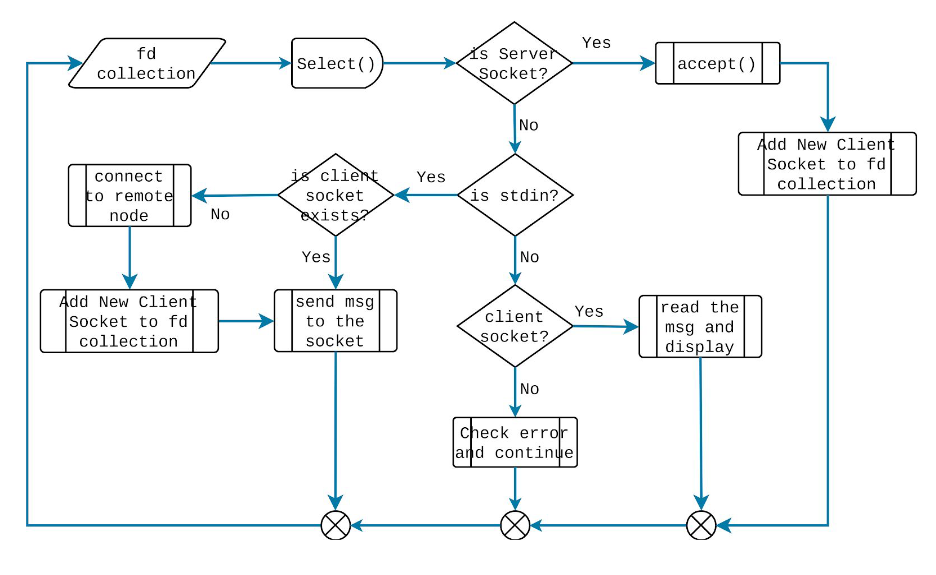

# Peer-2-Peer-Chat-Application
A network application - Peer-to-Peer Chat Application for multiple users

 

## Introduction
A peer-to-peer (P2P) application is an application primitive, where there are no dedicated central server
nodes. Every node in the network can connect with each other and transfer data among
themselves.

In this P2P chat application, we consider a close group of friends who want to chat with each
other. The chat application uses TCP as the underlying transport layer protocol. For P2P
implementation, every instance of the chat application runs a TCP server (we call this as
peer-chat server) where the chat application listens for incoming connections. The protocol
details are as follows. The same process of the application also runs one or multiple TCP
clients (based on the number of peers) to connect to the other users and transfer messages.

## Design 
1. The entire chat application runs under a single process.
2. Every participating user maintains a user_info table that contains - (a) name of the
friend, (b) IP address of the machine where the chat application is running, (c) port
number at which the peer-chat server is running. This table is static and shared a
priori with all the participating users.
3. For the chat purpose, a user enters a message using the keyboard. The message
format is as follows: friendname/<msg> where friendname is the name of the
friend to whom the user wants to send a message, and msg is the corresponding
message.
4. The communication mode is asynchronous, indicating that a user can enter the
message anytime. The console should always be ready to accept a new message
from the keyboard, unless the user is already typing another message.

## Protocol Primitives:
1. As we mentioned earlier, every instance of the chat application runs a TCP server
which binds itself to a well known port and keeps on listening for the incoming
connections. You may assume a maximum of 5 peers (users), so a maximum of 5
connections need to be supported.
2. Once the server receives a connection, it accepts the connection, reads the data
from that connection, extracts the message, and displays it over the console.
3. Once a user enters a message through the keyboard,
a. The message is read from the stdin, the standard input file descriptor.
b. The application checks whether a client socket to the corresponding server
already exists. If a client socket does not exist, then a client socket is created
to the corresponding server based on the lookup over user_info table
c. The message is sent over the client socket
4. If there is no activity over the client socket for a timeout duration, then the client
socket is closed.
As all the above functionalities are executed over a single process, you need a way to
maintain multiple file descriptors, and handle them in an iterative way. This is accomplished
by the select() system call. A flow diagram of the entire process is given next.

 

